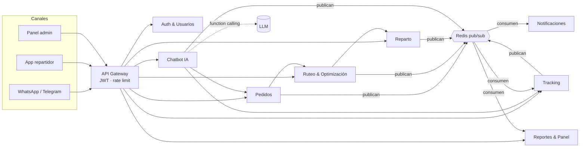
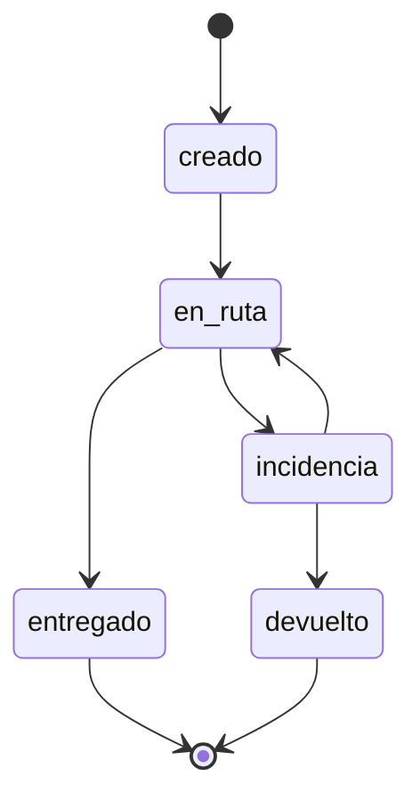

# paqueteria-ia — Logística Inteligente de Última Milla

Plataforma para una paquetería mediana en México que cubre el ciclo completo de la última milla: **registro de pedidos, ruteo optimizado, reparto con evidencia, tracking en tiempo real, chatbot con IA y panel administrativo**.

> Estado: fase de definición (v1.0 del documento de visión, septiembre 2026). Proyecto académico de un semestre.

---

## El problema

Muchas paqueterías medianas en México operan la última milla de forma manual:

- Las rutas se asignan a criterio del despachador.
- La atención al cliente es por teléfono y con consultas repetitivas.
- Las entregas tienen poca evidencia verificable.
- Las incidencias se detectan tarde y hay poca visibilidad en tiempo real.

Además, hay condiciones locales que las plataformas internacionales no priorizan: el uso frecuente del **pago contra entrega (COD)** y la **cobertura de señal irregular** en zonas como Michoacán y áreas rurales.

## Visión

> Ofrecer a las paqueterías medianas de México una plataforma de logística de última milla inteligente, que automatice la atención al cliente con IA, optimice las rutas de reparto y dé visibilidad total de cada envío en tiempo real, diseñada para la realidad local del pago contra entrega y la conectividad irregular.

### Objetivos

- Automatizar la atención al cliente con un **chatbot con IA** (WhatsApp/Telegram) que escala a un humano cuando no puede resolver.
- Generar **rutas optimizadas** según ubicación, capacidad de vehículos y prioridades.
- Permitir al repartidor registrar **evidencia de entrega** (foto, firma, geolocalización) y reportar incidencias desde su celular.
- Dar al operador **visibilidad en tiempo real** de la flota, con alertas y capacidad de reasignación.
- Proveer a la gerencia **métricas de desempeño**.
- Construir una arquitectura de **microservicios** desplegable de forma independiente en Google Cloud Run.

### Criterios de éxito

Medidos desde el propio panel administrativo:

| Indicador | Qué mide |
|---|---|
| Tasa de entregas exitosas | % de pedidos entregados al primer intento |
| Tiempo promedio de entrega | Desde la asignación de ruta hasta la confirmación |
| Resolución del chatbot | % de conversaciones resueltas sin escalar a un humano |
| Entregas con evidencia | % de entregas con foto, firma y geolocalización |
| Tiempo de reacción a incidencias | Desde el reporte hasta la acción del operador |

## Usuarios

| Rol | Necesidades principales |
|---|---|
| **Cliente** (remitente/destinatario) | Consultar estado sin llamar, reagendar, reportar incidencias, recibir evidencia, hablar con un humano |
| **Repartidor** | Ruta del día optimizada, registrar evidencia de forma simple, reportar incidencias |
| **Operador / Despachador** | Ver flota y pedidos en tiempo real, reasignar, recibir alertas, atender conversaciones escaladas |
| **Administrador / Gerente** | Métricas y reportes para tomar decisiones |
| **Administrador del sistema** | Usuarios y roles, integraciones, salud de servicios y colas |

## Alcance del MVP

| Módulo | Funcionalidad |
|---|---|
| Pedidos | Registro y ciclo de vida: creado → en ruta → entregado / incidencia / devuelto |
| Ruteo y optimización | Orden de paradas considerando capacidad y prioridades (VRP con Google OR-Tools) |
| Reparto | Ruta del repartidor, evidencia de entrega e incidencias de campo |
| Tracking | Eventos GPS de alta frecuencia y ubicación actual de cada repartidor |
| Chatbot IA | Atención en WhatsApp/Telegram con LLM y function calling; escalamiento a humano |
| Notificaciones | Avisos por WhatsApp/SMS/push a partir de eventos |
| Reportes y panel admin | Métricas, alertas y vista en tiempo real |
| Auth y usuarios | Login, roles y emisión/validación de JWT |

**Fuera del MVP (roadmap):** logística inversa, modo offline para repartidores, conciliación de COD, multi-tenant/white-label, micro-hubs, huella de carbono, integración con marketplaces, portal de autoservicio y validación de evidencia con IA.

## Arquitectura

Microservicios descompuestos por *bounded context* del dominio de última milla.

### Principios

- **Un servicio por subdominio**, cada uno con su propia base de datos (*database-per-service*); nada de joins entre bases.
- **Persistencia políglota:** PostgreSQL para datos con integridad referencial; MongoDB para escritura masiva y esquema variable.
- **Punto único de entrada:** API Gateway con JWT, rate limit y enrutamiento.
- **Comunicación híbrida:** REST para consultas síncronas y Redis pub/sub para eventos asíncronos.
- **El dato lo da el servicio, no el modelo:** el LLM nunca inventa estados, siempre consulta al microservicio dueño.
- **Despliegue independiente:** un Dockerfile y un pipeline por servicio en Cloud Run.

### Vista general

### Microservicios

| Microservicio | Responsabilidad | Almacenamiento |
|---|---|---|
| Auth & Usuarios | Login, roles, emisión y validación de JWT | PostgreSQL |
| Pedidos | Ciclo de vida del envío | PostgreSQL |
| Ruteo & Optimización | Resolver VRP: orden de paradas y capacidad (OR-Tools) | PostgreSQL |
| Reparto | Ruta del repartidor, evidencia, incidencias | PostgreSQL |
| Tracking | Eventos GPS y ubicación actual | MongoDB |
| Chatbot IA | Conversaciones, integración con LLM, escalamiento | MongoDB |
| Notificaciones | Avisos por WhatsApp/SMS/push consumiendo eventos | — |
| Reportes & Panel Admin | Métricas y alertas (modelo de lectura) | PostgreSQL (read model) |

### Eventos (Redis pub/sub)

| Evento | Publica | Consumen |
|---|---|---|
| `pedido_creado` | Pedidos | Notificaciones, Reportes |
| `ruta_asignada` | Ruteo | Notificaciones, Reportes, Tracking |
| `entrega_confirmada` | Reparto | Notificaciones, Reportes, Tracking |
| `incidencia` | Reparto | Notificaciones, Reportes |
| `ubicacion_actualizada` | Tracking | Reportes |
| `escalado_a_humano` | Chatbot IA | Notificaciones, Reportes |

### Ciclo de vida del pedido

### Inteligencia artificial

| Funcionalidad | Tipo de modelo | Tecnología | Fase |
|---|---|---|---|
| Chatbot de atención | LLM + function calling | Claude / GPT-4o mini / Gemini | MVP |
| Optimización de rutas | Optimización combinatoria (VRP) | Google OR-Tools | MVP |
| Clasificación de incidencias | Clasificación de texto zero-shot | Mismo LLM del chatbot | Roadmap |
| Validación de evidencia fotográfica | Visión por computadora | LLM multimodal / Cloud Vision | Roadmap |

## Stack tecnológico

| Capa | Tecnología |
|---|---|
| Backend | Python, Django, Django REST Framework |
| Bases de datos | PostgreSQL, MongoDB |
| Mensajería | Redis pub/sub |
| IA | LLM con function calling; Google OR-Tools |
| Canales | WhatsApp Business API, Telegram, SMS, push |
| Contenedores y nube | Docker, docker-compose (local), Google Cloud Run, Secret Manager |
| Repositorio y CI | GitHub (monorepo), GitHub Actions |
| Calidad de código | PEP 8, Black, isort, Ruff, pytest + pytest-django, Conventional Commits |
| Frontend del panel | Por definir (React, Vue u otro) |

## Despliegue

- Cada microservicio tiene su propia imagen Docker y se despliega de forma independiente en **Google Cloud Run**.
- **GitHub Actions** ejecuta lint y tests por servicio (path filtering); un merge a `main` dispara el despliegue.
- Los secretos de producción viven en **Google Cloud Secret Manager**; en el repo solo se versiona `.env.example`.
- En local, todo el stack se levanta con **docker-compose**.

## Flujo de trabajo

- **Monorepo** en GitHub.
- **Git Flow simplificado:** `main`, `develop`, `feature/*`, `release/*`, `hotfix/*`.
- PRs con revisión y CI obligatorio; commits con [Conventional Commits](https://www.conventionalcommits.org/).

## Plan de entregas

| Semanas | Fase | Entregables |
|---|---|---|
| 1–3 | Definición | Investigación de mercado, dominio, arquitectura, estándares |
| 4–7 | Construcción de microservicios | Servicios de negocio en `feature/*` sobre `develop` |
| 8–9 | Seguridad | JWT, Auth y API Gateway |
| 10–12 | Integración asíncrona e IA | Redis pub/sub, chatbot con LLM, OR-Tools; primera `release/*` |
| 13–16 | Despliegue y CI/CD | Pipelines a Cloud Run, Secret Manager, protecciones de `main` |

### Roadmap posterior al MVP

- **Fase 2:** logística inversa, modo offline para repartidores y conciliación de pagos COD.
- **Fase 3:** clasificación automática de incidencias, validación de evidencia con IA y portal de autoservicio.
- **Fase 4:** ETAs dinámicos con ML, micro-hubs, reportes de sostenibilidad, integración con marketplaces y multi-tenant.

## Licencia

Ver [LICENSE](LICENSE).
